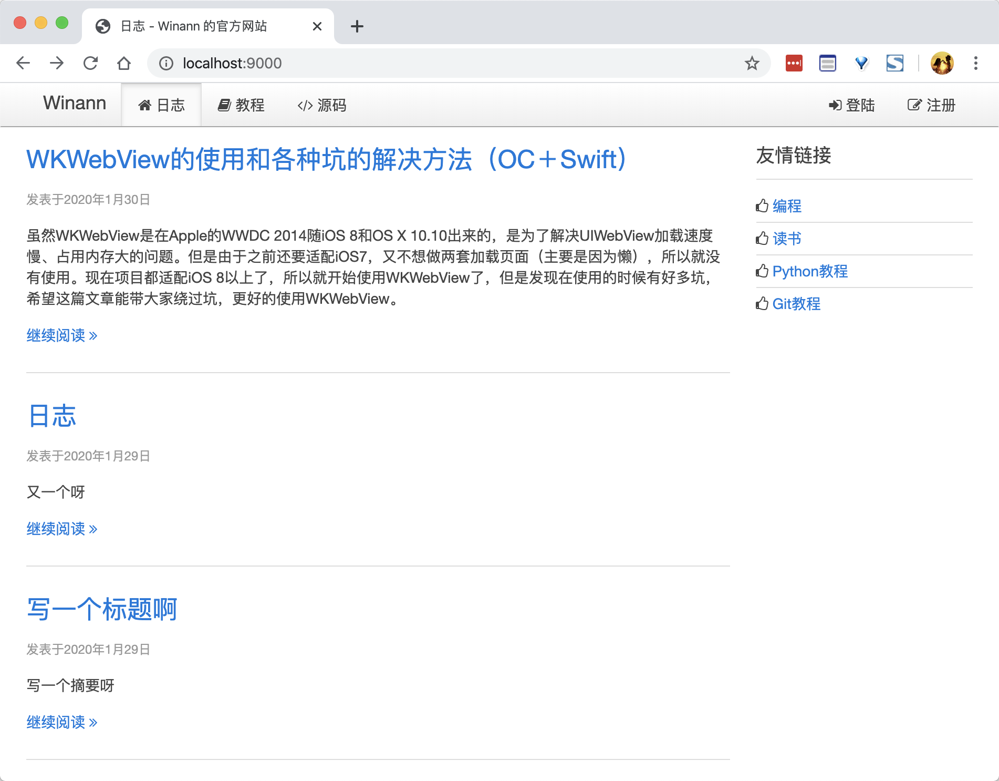
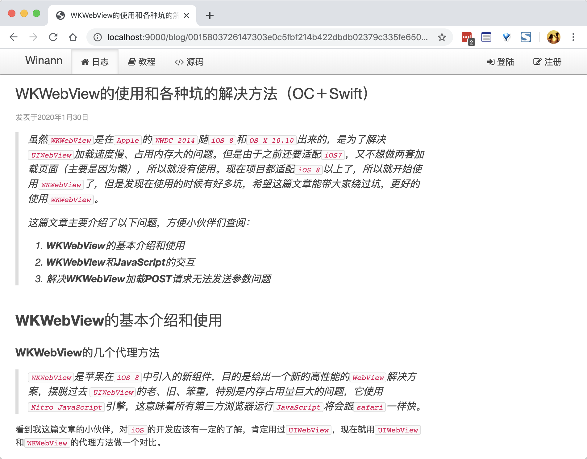
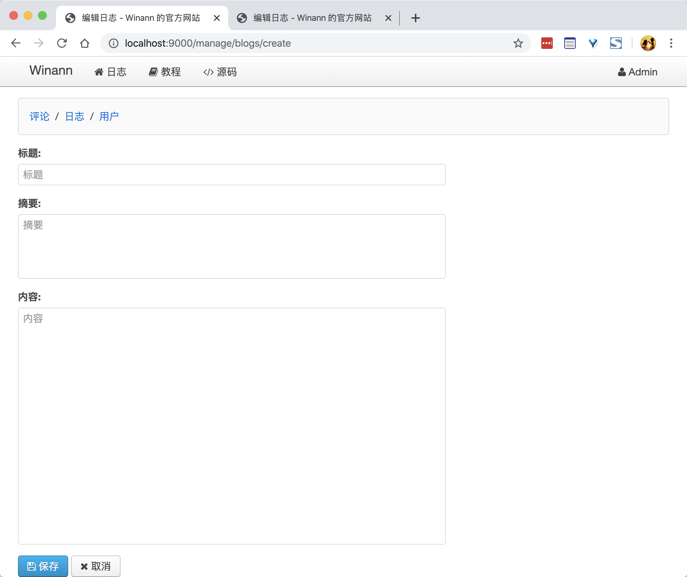

# PyBlog
> 基于 Python3 实现的 web 后台
>
> 通过学习[廖雪峰老师的 Python 教程](https://www.liaoxuefeng.com/wiki/1016959663602400)的[实战](https://www.liaoxuefeng.com/wiki/1016959663602400/1018138095494592)模块完成

### 模块说明

> `pip install -r requirements.txt` 或者 `pip3 install -r requirements.txt` 安装

使用了以下模块，请使用 pip 或者自己使用的其他工具安装（如有新的版本，可以试用看有无问题，否则请使用如下版本）

```
aiohttp==3.6.2
watchdog==0.10.0
aiomysql==0.0.20
Jinja2==2.10.3
fabric==2.5.0
```

1. aiohttp：Web 框架
2. watchdog：调试的时候可以在更改 `.py` 文件之后重启服务器
3. aiomysql：异步的 mysql 链接框架
4. Jinja2：渲染前端模版的框架
5. fabric：发布到服务器的模块
6. Mysql(8.0.18): 数据库

### 使用方法

1. 安装 `mysql` 数据库并且启动

2. 启动终端，进入 `PyBlog-aiohttp/conf` 路径

3. 创建需要的表（输入命令：`mysql -u root -p < schema.sql` 并输入数据库 root 账户的密码）

4. 进入 `PyBlog-aiohttp/www` 

   * 运行 `python3 pymonitor.py app.py` 可以在编辑完成之后重启服务器
   * 运行 `python3 app.py` 启动服务器

5. 浏览器输入 [http://localhost:9000/](http://localhost:9000/) 访问

   注意：如果要写博客，需要在管理员的账户（在数据库中将 `admin` 字段置为 `1`）

### 效果





